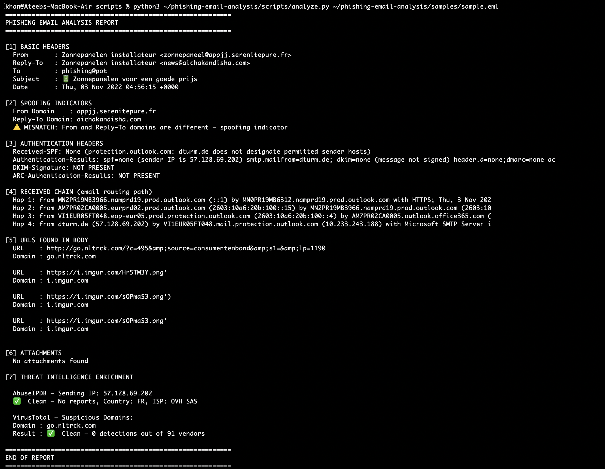

# Phishing Email Analysis Tool

A hands-on SOC analyst project where I built a Python tool to analyze real phishing email samples. The tool automates header forensics, spoofing detection, and threat intelligence enrichment using AbuseIPDB and VirusTotal APIs.

---

## Why I Built This

Phishing triage is one of the most common tasks a Tier 1 SOC analyst handles daily. I wanted to understand what actually happens inside a phishing email — not just theoretically, but by pulling apart a real sample and building a tool that automates the analysis process.

---

## What the Tool Does

Takes any `.eml` file and produces a structured analysis report covering:

- **Header extraction** — From, Reply-To, Subject, Date
- **Spoofing detection** — flags mismatches between From and Reply-To domains
- **Authentication checks** — SPF, DKIM, DMARC status
- **Received chain analysis** — traces the real sending path and extracts the origin IP
- **URL extraction** — pulls all URLs from the email body
- **Attachment detection**
- **Threat intelligence enrichment** — queries AbuseIPDB for the sending IP and VirusTotal for suspicious domains

**Usage:**
```bash
python3 scripts/analyze.py <path_to_email.eml>
```

---

## Sample Analysis — Dutch Solar Panel Phishing Email

I analyzed a real phishing sample from a public phishing repository. Here's what the tool found:

### Tool Output


### Key Findings

| Indicator | Finding |
|-----------|---------|
| SPF | Failed — sending IP not authorized |
| DKIM | Not present — email unsigned |
| DMARC | None — no policy enforced |
| From Domain | appjj.serenitepure.fr |
| Reply-To Domain | aichakandisha.com — mismatch, spoofing confirmed |
| Actual Sending IP | 57.128.69.202 — OVH SAS, France |
| Payload URL | go.nltrck.com — affiliate redirect chain |

### Threat Intelligence Results
- **AbuseIPDB:** IP came back clean but is hosted on OVH SAS — a provider frequently abused for phishing infrastructure. Clean score ≠ legitimate sender.
- **VirusTotal:** Domain returned 0 detections out of 91 vendors — common for newly registered redirect domains used in active campaigns. This highlights a real limitation of reactive threat intel: databases lag behind live attacks.

Full incident report → [`findings/incident-001.md`](findings/incident-001.md)

---

## What I Learned

- How SPF, DKIM, and DMARC work together and what their complete absence means in practice
- How attackers separate From and Reply-To domains to redirect victim replies
- How to trace the true origin of an email through the Received chain and skip internal/private IPs
- How phishing campaigns use affiliate redirect URLs and external image hosting to evade content filters
- How to use AbuseIPDB and VirusTotal APIs for threat intelligence enrichment
- Why a "clean" result on threat intel platforms doesn't mean safe — and how to think critically about that in a SOC context

---

## What I Would Do Next in a Real SOC

1. Block sending IP at the email gateway
2. Block redirect domain at the web proxy
3. Search SIEM for other emails from the same IP across the organization
4. Submit IOCs to internal threat intel platform
5. Check proxy logs for any users who clicked the redirect link
6. Notify affected mailbox owner

---

## Tool Limitations

- IP extraction picks the first public IP in the Received chain — may miss true origin in complex routing
- VirusTotal and AbuseIPDB results are point-in-time — clean results don't confirm legitimacy
- URL extraction uses regex — may miss obfuscated or encoded URLs

---

## Repository Structure

phishing-email-analysis/
├── scripts/
│   └── analyze.py           # Python analysis tool
├── findings/
│   ├── incident-001.md      # Full incident report
│   ├── sample-output.txt    # Raw tool output
│   └── terminal-screenshot.png  # Tool running proof
└── samples/                 # .eml samples excluded for safety

> ⚠️ Note: `.eml` sample files are excluded from this repo — phishing emails contain live malicious URLs. Download your own samples from [phishing_pot](https://github.com/rf-peixoto/phishing_pot)

---

## Tools & APIs Used

- Python 3 (standard library only — `email`, `re`, `urllib`, `json`)
- [AbuseIPDB API](https://www.abuseipdb.com) — IP reputation
- [VirusTotal API](https://www.virustotal.com) — domain reputation
- Real phishing samples from [phishing_pot](https://github.com/rf-peixoto/phishing_pot)