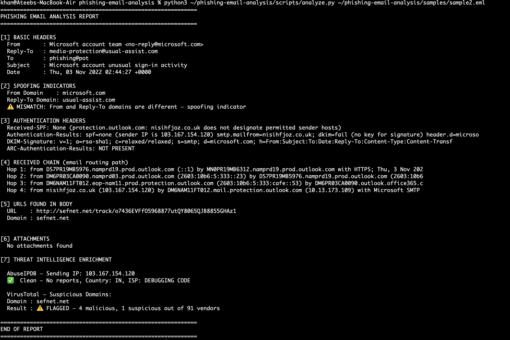
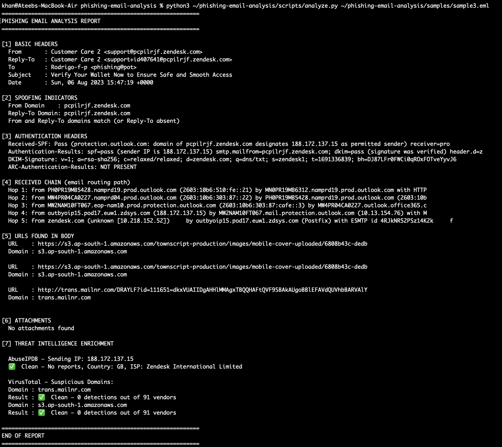

# Phishing Email Analysis Tool

A hands-on SOC analyst project where I built a Python tool to analyze real phishing email samples. The tool automates header forensics, spoofing detection, and threat intelligence enrichment using AbuseIPDB and VirusTotal APIs. Three real phishing samples were analyzed, each representing a different attack technique and sophistication level.

---

## Why I Built This

Phishing triage is one of the most common tasks a Tier 1 SOC analyst handles daily. I wanted to understand what actually happens inside a phishing email — not just theoretically, but by pulling apart real samples and building a tool that automates the analysis process. I also wanted to understand the limitations of automated detection — Sample 3 taught me that passing all authentication checks doesn't mean an email is safe.

---

## What the Tool Does

Takes any `.eml` file and produces a structured analysis report covering:

- **Header extraction** — From, Reply-To, Subject, Date
- **Spoofing detection** — flags mismatches between From and Reply-To domains
- **Authentication checks** — SPF, DKIM, DMARC status
- **Received chain analysis** — traces the real sending path, extracts origin IP (skips private/internal IPs)
- **URL extraction** — pulls all URLs from the email body
- **Attachment detection**
- **Threat intelligence enrichment** — queries AbuseIPDB for sending IP and VirusTotal for suspicious domains

**Usage:**
```bash
python3 scripts/analyze.py <path_to_email.eml>
```

---

## Samples Analyzed

Three real phishing emails analyzed, each representing a different attack technique:

| | Sample 1 | Sample 2 | Sample 3 |
|--|---------|---------|---------|
| **Type** | Promotional scam | Brand impersonation | Platform abuse |
| **Target** | Dutch speakers | Microsoft users | Crypto wallet holders |
| **SPF** | Fail | Fail | Pass |
| **DKIM** | Absent | Forged/Fail | Pass |
| **DMARC** | None | Fail | Pass |
| **TI Hit** | Clean | VT Flagged | Clean |
| **Severity** | Medium | High | Critical |
| **Filter Bypass** | Partial | Partial | Complete |

---

## Sample 1 — Dutch Solar Panel Phishing


Basic phishing email advertising cheap solar panels to Dutch speakers. Uses From/Reply-To domain mismatch and affiliate redirect URL. All three authentication mechanisms fail.

**Key finding:** Sending IP on OVH SAS — a provider frequently abused for phishing infrastructure. Clean AbuseIPDB score does not equal legitimate sender.

Full report → [`findings/incident-001.md`](findings/incident-001.md)

---

## Sample 2 — Microsoft Account Impersonation


Impersonates Microsoft's account security team using urgency ("unusual sign-in activity"). Forges a DKIM signature claiming to be from microsoft.com. Payload domain confirmed malicious on VirusTotal.

**Key finding:** VirusTotal flagged `sefnet.net` with 4 malicious detections — the only sample with a confirmed TI hit. Sending IP traced to India, inconsistent with Microsoft infrastructure.

Full report → [`findings/incident-002.md`](findings/incident-002.md)

---

## Sample 3 — Zendesk Platform Abuse / Crypto Wallet Phishing


The most sophisticated sample. Attacker created a free Zendesk account and used Zendesk's own mail servers to send the attack — causing SPF, DKIM, and DMARC to all pass. Would bypass most automated email filters entirely. Only detectable through behavioral analysis.

**Key finding:** Passing authentication does not mean an email is safe. This sample would be delivered to every inbox unchallenged by standard filters. Detection requires behavioral indicators — random subdomain, obfuscated redirect, AWS Mumbai hosted assets, crypto urgency language.

Full report → [`findings/incident-003.md`](findings/incident-003.md)

---

## What I Learned

- How SPF, DKIM, and DMARC work together and what their absence or failure means in practice
- How attackers forge DKIM signatures and why they still fail verification
- How "living off trusted infrastructure" allows phishing to bypass authentication entirely
- How to trace the true email origin through the Received chain
- How affiliate redirect URLs and external image hosting evade content filters
- Why clean threat intel results require behavioral context — not blind trust
- How to write structured incident reports with IOCs and SOC response steps

---

## What I Would Do Next in a Real SOC

Varies by sample — full response steps documented in each incident report. General approach:
1. Block sending IP and malicious domains at email gateway and web proxy
2. Search SIEM for other emails from same infrastructure
3. Check proxy logs for victim clicks
4. Escalate if any user interacted with the payload
5. Report platform abuse to the legitimate provider (e.g. Zendesk)

---

## Tool Limitations

- IP extraction picks the first public IP in the Received chain — may miss true origin in complex routing
- VirusTotal and AbuseIPDB are point-in-time — clean today may be flagged tomorrow
- URL extraction uses regex — may miss obfuscated or base64-encoded URLs
- Cannot detect platform-abuse phishing through authentication checks alone — behavioral analysis required

---

## Repository Structure
phishing-email-analysis/
├── scripts/
│   └── analyze.py              # Python analysis tool
├── findings/
│   ├── incident-001.md         # Dutch solar panel phishing report
│   ├── incident-002.md         # Microsoft impersonation report
│   ├── incident-003.md         # Zendesk platform abuse report
│   ├── sample1_output.png      # Terminal screenshot — sample 1
│   ├── sample2_output.png      # Terminal screenshot — sample 2
│   ├── sample3_output.png      # Terminal screenshot — sample 3
│   ├── sample1_output.txt      # Raw tool output — sample 1
│   ├── sample2_output.txt      # Raw tool output — sample 2
│   └── sample3_output.txt      # Raw tool output — sample 3
└── samples/                    # .eml files excluded for safety

> ⚠️ `.eml` sample files are excluded — phishing emails contain live malicious URLs. Download your own from [phishing_pot](https://github.com/rf-peixoto/phishing_pot)

---

## Tools & APIs Used

- Python 3 (standard library — `email`, `re`, `urllib`, `json`)
- [AbuseIPDB API](https://www.abuseipdb.com) — IP reputation
- [VirusTotal API](https://www.virustotal.com) — domain reputation
- Real phishing samples from [phishing_pot](https://github.com/rf-peixoto/phishing_pot)